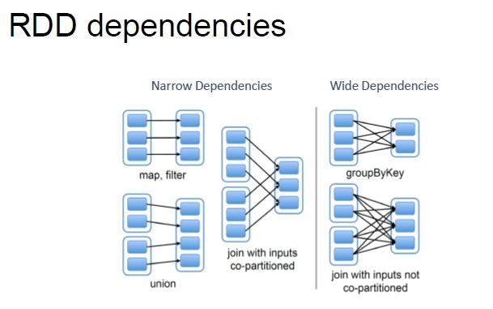
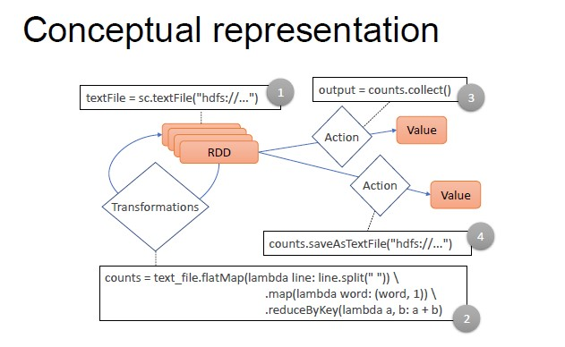

# Apache Spark

*How did we get from Hadoop's MapReduce to Spark?*

Hadoop's MapReduce is the result of many years of development but in the meanwhile, a lot has changed.
Before, disk was the primary source of data and machines were mostly single core.
Now, RAM is the primary source of data and machines are mostly multi core.

**Limitations of MapReduce:**

- It is designed for batch processing
- It has a strict paradigm
- New hardware capabilities are not exploited
- Too much complex 

## Apache Spark Framework

Spark relies on two main abstractions:

- **RDD (Resilient Distributed Dataset)**: immutable distributed collection of objects
    - **Resilient** (automatically rebuild on failure)
    - **Distributed** (the objects belonging to a given collection are split into partitions and spread across the nodes)
    - **Immutable** (once created, it cannot be modified)
    - **Lazily evaluated** (optimization before execution)
    - **Cachable** (it can persist in memory, spill to disk if necessary)
    - **Type inference** (data types are not declared but inferred)

- **DAG (Direct Acyclic Graph)**: based on the user application and on the lineage graphs. Sparks computes a logical execution plan in the form of a DAG.
    - Sequence of computations performed on data
    - Nodes are the RDD (created to compute the result)
    - Edges represents the operations
    The execution plan is compiled into physical stages

## RDD 

**Creation**

RDD can be created in two ways:

1. By loading an external dataset
2. By distributing a collection of objects that you have in memory

By default, RDD are not persisted: they are recomputed each time they are needed in an action.
Therefore, there is no need to occupy memory if the RDD is not used again. 

**Operations**

RDDs offer two types of operations:

1. Transformations (all the operations that allow you to create a new RDD from a previous one)
2. Actions (compute a result that is either returned to the driver program or saved to an external storage system)

**Metadata**

RDD transformations cause only metadata change. Each RDD stores a set of a metadata:

- Partitions (set of data splits associated with the RDD)
- Partitioner (how the data is split into partitions)
- Dependencies (list of parent RDDs involved in computation)
- Compute (function to compute partition of the RDD, given the parent partitions from the dependencies)
- Preferred locations (where is the best place to put computations on this partition)

**Lineage**

The set of RDD dependencies is logically represented as a linear graph which allows for fault tolerance system without checkpointing.
The derived physical execution plan can be optimized by aggregating different operations and exploiting data locality.

**Dependencies**

In the dependency graph, we can distinguish between two kinds of dependencies:

1. Narrow dependencies (it allows for pipelining on one cluster node)
2. Wide dependencies  (it cannot be pipelined, as they require data shuffling)

**Persistence**

Persisting a dataset in memory across operations is one of Spark's most important capabilities.
By default, each RDD is recomputed each time an action is run on it. When you persist an RDD, each node stored in memory the partitions that are computed, allowing for faster future actions.

## Spark Application Decomposition

- Application (single instance of SparkContext that stores data processing logic and schedules series of jobs, sequentially or in parallel)
- Job (complete set of transformations on RDD that finishes with action or data saving, triggered by the driver application)
- Stage (set of transformations that can be pipelined and executed by a single independent worker)
- Task (basic unit of scheduling which executes the stages on a single data partition)

