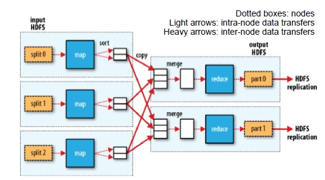
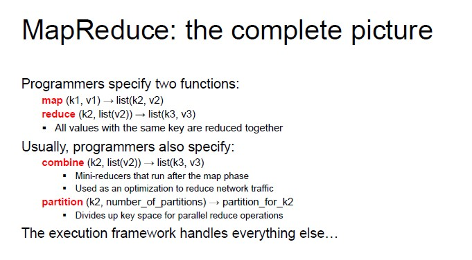

# Map Reduce

It is based, in general, on key-value pairs (data is structured in couples). It is a programming model and an associated implementation for processing and generating large data sets.

How it works:

It is based on typical analytical problems, in which you have large datasets and you want to extract something, you reorganize the data to compute aggregations and generate a final output.

**Map operations and reduce operations**

- MAP takes a function f and applies it to every element in a list
- FOLD iteratively applies a function g to **aggregate** results

## Parallelization

The map operation includes all operations can be parallelized in a straightforward manner, since each functional application happens in isolation.

Reduce operation has more restrictions on data locality.

## MapReduce Program

The map function requires an input (key-value pairs), that are chosen by the programmer.

- Map (k1, v1) -> list(k2, v2)
- Reduce  (k2, list(v2)) -> list(k3, v3)

The output of the map function is a list containing all the values in the row, while the reduce function takes as input a key and the list with all the values associated with that key.

MapReduce program = **job**

- Each job is divided into smaller units called **tasks**
- The tasks are scheduled using YARN and run on nodes in the cluster

## MapReduce Process

1. Input is divided into fixed-size splits
2. A Map task is created for each split
3. The key-value pairs returned by Map tasks are sorted and stored in the local disk
4. Map outputs are sent to the nodes where the Reduce tasks are running
5. The key-value pairs returned by Reduce tasks are written persistently onto the DFS



## Example - Word Count

Counting the  number of occurrences for each word in a collection of documents.

**Input:** a repository of documents (each document is a value in the input pairs)

**Map function:** read a document and emit a sequence of key-value pairs

**Shuffle and Sort:** group by key and generate a pairs of the form

**Reduce function:** add up all the values for a given key and emits a pair of the form (w, m)

**Output:** w is a word that appears at least once among all the input documents; m is the total number of occurrences of w among all those documents

```java

Map(String docid, String text):
    for each word w in text:
        Emit(w, 1);

Reduce(String term, counts[]):
    int sum = 0;
    for each c in counts:
        sum += c;
    Emit(term, sum);

```

## Map in Java

```java

public class WordCountMapperextendsMapper<LongWritable, Text, Text, IntWritable> {
    private static final IntWritableone = newIntWritable(1);
    privateText word = newText();
    public void map(LongWritablekey, Text value, Context context) 
        throwsIOException, InterruptedException{
    String line = value.toString();
    StringTokenizertokenizer = newStringTokenizer(line);
    while(tokenizer.hasMoreTokens()) {
        word.set(tokenizer.nextToken());
        context.write(word, one);
        }
    }
}

```

## Reduce in Java

```java

public class WordCountReducerextendsReducer<Text, IntWritable, Text, IntWritable> {
    public void reduce(Text key, Iterable<IntWritable> values, Context context)     
        throwsIOException, InterruptedException{
    intsum = 0;
    for(IntWritablevalue : values) {
        sum += value.get();
    }
    context.write(key, newIntWritable(sum));
    }
}

```

## Combiners
When the reduce function is associative and commutative, we can push some of what the reducers do to the Map tasks. 
In this case, we also apply a combiner to the Map function. The combiner function must be **associative** and **commutative.**

Advantages:

- It reduces the amount of intermediate data
- It reduces the network traffic

## Data Partitioning

**Maps:**

- Partitioning depends on the input splits
- One map task per input split

**Reducers:**

- Data is shuffled and according to partitioning function, it decides, for each key, which reducers it goes to
- Based on the number of nodes and available resources
- Can be defined by the user

The keyspace of the intermediate key-value pairs is evenly distributed over the reducers with a hash function (same keys in different mappers end up at the same reducer).
The partitioning of the intermediate key-value pairs generated by the maps can be customized.

**How does it work:**

- Let p be the number of reduce tasks
- The partitioner adopts a hash function that translates a key to a number from 0 to p-1
- Each output ket-value pair is stored in one of p files
- The reduce task collects from every map task the partitions with the same hash value

**Tuning the number of reduce tasks**

Hadoop used to create only one, global reduce task by default (mainly used).
Deciding the number of reduce task is not easy; it is more an art than a science.

One solution would be to devise single task for every CPU available in the cluster. In this way, all CPUs are working but in reality, there are often more keys to process than available CPUs.

Another solution would be to create multiple tasks for each CPU. From a certain perspective, it may seem a waste but actually, this solution mitigate skewness problems.

General rule of thumb: each task should run for about 5 minutes and produce more than 1 HDFS block's worth of output.



## MapReduce Execution
 An important idea behind MapReduce is separating the *what* of distributed processing from the *how.*

 The developer launches the job on the client's JMV, which contacts the YARN RM to submit the application.

 **Data locality enforcement**
Main principle: do not move data to workers, move workers to data.

The task are created from the input splits in the shared file system

**Optimization:** prefer nodes that are on the same rack in the data center as the on holding the data block. Inter-rack bandwidth is significantly less than intra-rack bandwidth.

## Map Execution STEPS


