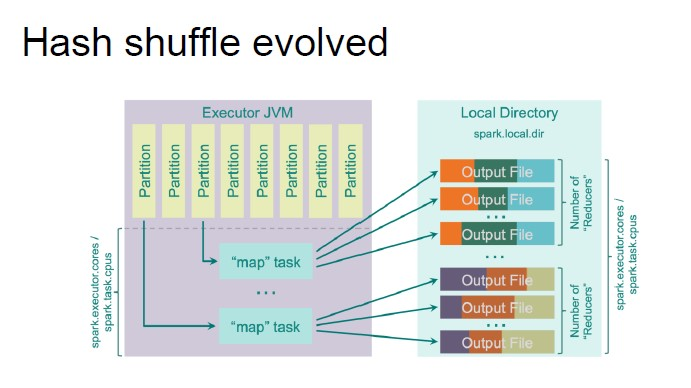
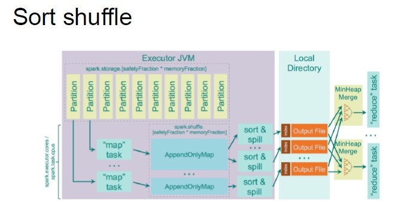

# Partitioning

Data in RDD are split into multiple partitions, which serve two purposes:

1. parallelize computation across workers and CPU cores
2. Minimize network traffic for data exchange between executors

If not specified, SPark sets the number of partitions automatically. The number of partitions are important as one task is run for each partition:

Too few partitions results in less concurrency and risks from data skewness, while too many partitions results in excessive overhead in managing small tasks.

**Rule of thumb:**

- Lower bound: 2 partitions for each core
- Upper bounds:
    - each task should take at least 100/200 ms to execute
    - a block worth of data

When in doubt, more partitions is usually better.

## RDD Partitioning Criteria

The partitioning criteria is used to:

- Put values that belong to the same key in the same partition
- Define how the key should be distributed in different partitions
- No control over the specific worker node a partition goes to

Partition criteria triggers shuffle operations so, forcing a partitioning criteria on a RDD is costly and there is no explicit control over which worker node each key goes on.

**Different partitioning data:**

1. **Hash Partitioning:** hashing using the Java hashCode
2. **Range Partitioning:** distributes data into uniform ranges
3. **Custom Partitioning:** user-defined partitioning

**When is it useful?**

If I repartition an RDD based on some criteria, then I know that all the values with the same key will end up in the same partition.

## Shuffling

Shuffling is the mechanism used to re-distribute data across partitions. It is necessary to compute some operations but it is costly and complex.

In time, Spark has provided a number of shuffling implementations:

- **Hash shuffle:** each map task creates a file for every reducer. [In this article is explained clearly (kinda)](https://medium.com/@philipp.brunenberg/understanding-apache-spark-hash-shuffle-b9aed2d587b0)
    - Each executor holds a pool of files
    - A single group contains a file for every reducer
    - An executor contains as many groups as the mapper than can run in parallel in the executor itself
- **Sort shuffle:** each mapper keeps output in memory, spills to disk if necessary.
    - Each mapper spills to its own file
    - Each file is sorted by reducer
    - When a reducer ask for data, the pieces from each file are collected, sorted in memory, and sent to the reducer
- **Tungsten sort:** evolution of the sort shuffle, but it works on serialized data (no need to do de-serialization and serialization).
    - Improves performance of the sort shuffle technique
    - It works only under certain constraints

As of today, one single implementation is provided: *SortShuffleManager*

- If conditions allow it, tungsten sort is adopted
- Hash shuffle is convenient only if you need to create an output with few partitions (low number of files)
- Otherwise, sort shuffle is adopted

## Cluster Configuration

In the SPark architecture, the level of parallelization is also given by the number of resources allocated.

The number of resources that we can ask for is given in the amount of memory and CPU.
All the executors have the same configuration and the number of executors is fixed as well.

**Tuning CPU**

We can either set the number of **executors** or the cumber of **cores** per executors.
The best thing to do is to have fewer executor with a high number of cores. Single-core executors throw away the benefits that come from running multiple tasks in a single JVM.

When deciding the number of CPU, it is important to remember that not everything should be allocated to the executor, as there are other parties.

It is good practice to leave at least one core per machine for other services.

**Tuning Memory**

Tuning memory can be done by setting the amount of memory per executor.

We should keep in mind that executors with too much memory often result in excessive garbage collection delays.

