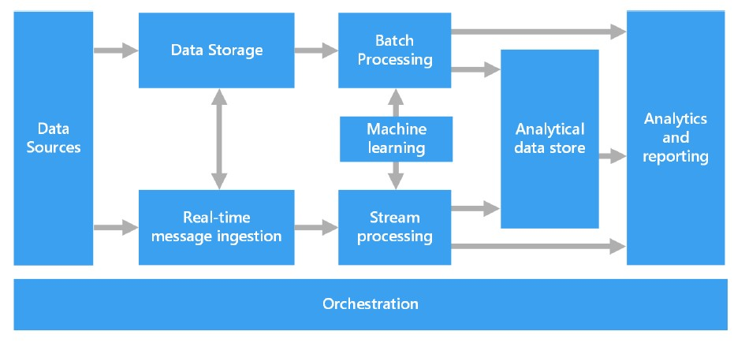

# Big Data Architectures

There are a lot of problems related to distributed architectures, especially concerning parallelization:

- Communication between workers
- Access to shared resources
- Parallelization and concurrency

The solution is to have single computer -> **Data Center**

The core is the **framework provider**, which is the set of software modules that handles the abstraction of the complexity of the computer system and makes it visible as if it was a single entity.

**System Orchestrator** -> manages application (both a human being or a program)

ADD DETAILS FROM THE SLIDES!!! 'til 28

ADD DETAILS

## Analytical Applications

- **Batch Analysis:** Take a large amount of data and run analysis
    - Run on demand
    - Takes a lot of time
- **Stream Analysis** We devised an algorithm that runs continuously 
    - Real-time results
    - Useful for monitoring

Can we run both batch and stream on the same set of data?

**Lambda architecture**
Most trivial way to handle this problem. It consists in duplicating the data in order to apply both analysis.
Data goes through two path:

- Hot path (timely, real-time, less accurate data)
- Cold path (less timely but more accurate data)

**Kappa architecture**
We can simplify the problem and handle everything a stream problem.
Stream and batch application are different BUT we can run batch analysis on a stream engine.
Data flows through a single patch, using a stream processing system. 

**Lambda vs Kappa**
Lambda is easier but it needs parallel development and maintenance of two parallel pipelines. 
Kappa is the ongoing trend. A streaming engine can handle a bounded dataset and a well-designed streaming systems provide a strict superset of batch functionality.

