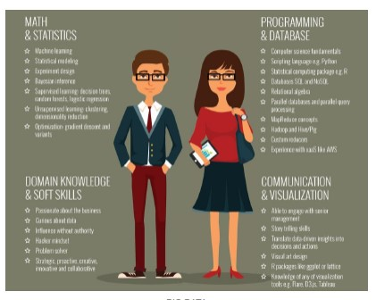

# Job Opportunities

Between 2019 and 2023, companies will hire 210K to 267K professionals with skills in mathematics, computer science, and 4.0.
Most demanded professional figures:
- Data Scientist
- Big Data Analyst
- Cloud Computing Expert
- Cyber Security Expert
- Business Intelligence Analyst
- Social Media Marketing Manager
- Artificial Intelligence Systems Engineer

## Data Scientist 
The main figure emerged with big data is the one of the data scientist (sexiest job in the world).

He deals with data analysis once data volume and velocity reaches a level requiring sophisticated technical skills.

## Data Architect 
Develop data architecture to effectively capture, integrate, organize, centralize and maintain data.

## Data Engineer
Develop, test and maintain data architectures to keep data accessible and ready for analysis.

## Data Analyst
Processes and interprets data to get actionable insights for a company.