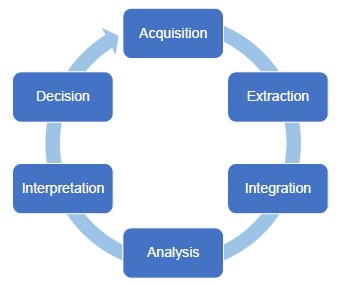

# Big Data Lifecycle 

## Acquisition

- Selection (understand which data is actually valuable)
- Filtering and Compression (very important because raw data is often too voluminous to store it all)
- Collect **Metadata**
Collecting Metadata is fundamental to understand, measure, and control the data. Metadata describes the data so it enables trustworthiness, reproducibility and debugging.

There are some software tools that allow you to collect metadata. This is a job that cannot be fully integrated. 
- human input is required in this phase :sad:

## Extraction

Depending on the analysis that you need to run, you work with specific data.

- Transformation and Normalization
- Cleaning and Error Handling
    - Very important because of the untrustworthy of big data

## Integration

In most cases, you will work with data coming from different sources, so, you will need to integrate them. 

The activities performed to integrate data:
- discover the relationship between datasets
- standardization, conflict management and entity resolution
    - resolve heterogeneity and conflicts in data structure and semantics
    - understand the trade-off of different modeling strategies

## Analysis

- Exploration (approach the data with new explorative approaches to gain a full understanding)
- Analytics (understand which approach works better to solve business problems)
- Delivery (find the best way to model and represent the results)

## Interpretation

You need to be careful because sometimes it is common to rush to conclusions.
It is important to verify the results:
- when you work with big data you should work on small artificial samples to verify expectations
- identify a subset of the data collected, analyze it and verify the results.

It is interesting to remember that CORRELATION between data does not always mean that it is real.

> Correlation is not Causation :heart:

## Decision

The decision-making process requires strong managerial skills 

