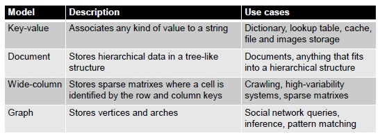

# NoSQL DBMS

Relational DBMS have lots of features like ACID properties, data integration and normalization schemas, standard model and query language and robustness.

However, a part from advantages, RDBMS have also weaknesses:

- Impedance mismatch (data are stored according to the relational model, but applications to modify them typically rely on the object-oriented model)
- Painful scaling-out (not suited for a cluster architecture and distributed environments)
- Consistency vs latency (today's applications require high reading/writing throughput with low latency)
- Schema rigidity (schema evolution is often expensive)

## NoSQL in the Big Data world

NoSQL systems are mainly used for operational workloads (**OLTP**).

Big data technologies are mainly used for analytical workloads (**OLAP**).

## Data Models

One of the key challenges is to understand which one fits best with the required application:

**Graph Data Model**

Each database contains one or more graphs. 
Each graph contains **vertices** and **arcs**.

- Vertices: usually represent real-world entities
- Arcs: represent direct relationships between the vertices

The graph data model is intrinsically different form the others:

- It is focused on the relationships rather than on the entities per-se
- It has limited **scalability** (it is often possible to shard a graph on several machines without cutting several arcs)
- It is a data-driven modeling
- It is based on the concept of **encapsulation**