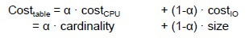
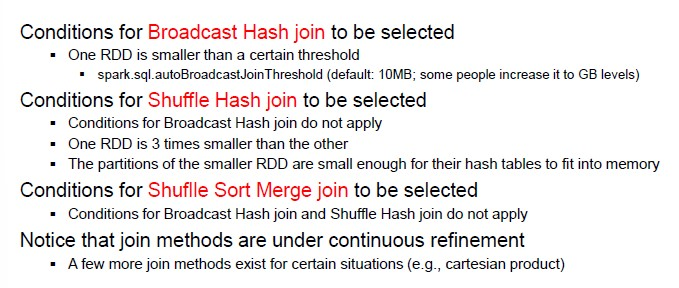

# SQL on Hadoop

SQL on Hadoop is a class of application tools that combine established SQL-style querying with newer Hadoop data framework elements

**SQL options on Hadoop**

1. Batch SQL (apache Hive)
2. In-Memory SQL (Apache Spark)
3. Interactive SQL (Impala)
4. Operational SQL (Apache HBase, NoSQL)

**Data storage**

- Only NoSQL database directly handle data storage
- Some tools provide a relational abstraction over HDFS

**Execution Engine**

- Most tools directly handle query execution
- Hive pushes execution to other tools

## Spark SQL

Instead of working with RDDs, we work with **datasets**.
With dataset, type conformity is checked at compile time.

They are **lazily evaluated** but supports under-the-hoop optimizations and code generation.

**Pros and Cons of Structure**

- Structure imposes some **limits** (RDDS enable any computation through user defined functions)
- The most common computations are supported
- Language simplicity
- Opens the room to **optimization**

The goal is to obtain an efficient and optimized logical plan, on which physical plans are generated.

## Logical Optimization

It is based on **rules**, which is a function that can be applied on a portion of the logical plan.

Several types of rules:

- Constant folding (resolve constant expressions at compile time)
- Predicate push-down (push selection predicates (filters) close to the sources)
- Column pruning (project only the required column)
- Join reordering (change the order of join operations)

These rules are applied recursively (maybe the application of a rule enables the application of another and so on) until the plan reaches a *fixed point* and no more optimization can be done.

## Physical Optimization

Once you have a physical plan, you also need to estimate the execution time.
The cost of operating on a certain dataset is characterized by the amount of time lost in terms of computation, CPU, I/O operations from the disk.

- I/O operations depends on the size of the data set
- The cost of the amount of computation depends on the cardinality of the dataset

Other important factors:

- Network throughput
- Disk throughput
- Allocation of resources
- Allocation of tasks

**Rule based physical optimization**

- Operation pipelining
- Predicate push-down (filtering performed during physical scan)

**Join method selection**

- **Broadcast Hash** join (if you have two dataset to join and one is not very big, you can replicate the same table for all the partition of the other dataset to avoid reorganization)
- **Shuffle Hash** join (data are reorganized based on the join attribute and the HJ method is applied)

To select a join method, the following conditions need to be considered:

## Adaptive Query Execution

Every time that you need to carry out a shuffle operation, the **catalyst** process is repeated again, because there are many parameters that have to be checked.

The main idea of AQE is to do reviews at each stage boundary.

If we want to carry out a join operation to identify the sales carried out in NY.
The sales dataset is partitioned by the stores, so we have multiple partitions (blocks) depending on the store_id.

WIthout optimization we would need to carry out the join on all the stores and then apply a filter on NY.

With AQE, we can partition data through broadcast hash join.

**Drawbacks**

- The execution stops at each stage boundary for SPark to review its plan but the gain in performance in usually worth
- The Spark UI is more difficult to read as each stage becomes a different job

