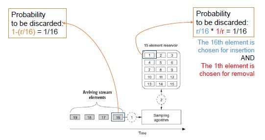

# Algorithms

##  Random Sampling with a Reservoir

Random sampling is a common technique in data streaming.

Use case: *YouTube*

The goal is to perform a real-time statistical analysis of the watched videos. On the surface it seems pretty easy, but, how do we know that data is random?

**Reservoir sampling** is based on the notion of reservoir.
We cannot hold a predetermined number of stream values but, when a new value arrives, we can probabilistically determine whether to add it to out collection or to discard it.

The reservoir is always filled with the first *r* values in the stream, where r is the size of the reservoir.

For any element, the probability to go inside or outside the reservoir is the same.

