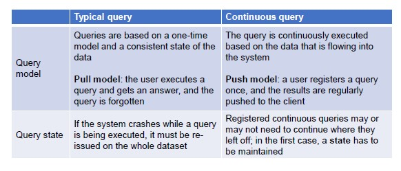

# Architecture

There is a lot of data movements among the different phases, which can be handles directly in the application that carry out the different activities or relying on a **message queueing service**.

This message queueing service works as a message bus connected to the single applications.

## Message Queuing Service

The message queueing tier handles the transportation of data between different tiers.

- By decoupling the pipeline of operations, each node in the cluster will do one job only
- Message queueing provides a solid framework for a safe communication between such nodes
- Message queuing handles funneling of n data streams to m consumers

In the message queueing system, we have he notion of a **borker**, which handles the communication, by means of queues.
The broker creates different queues, one for each topic, and keeps the data for a certain amount of time.

We can decide the level of **delivery semantics**, which refers to the level of precision in sending the message form producer to consumer.

- **Exactly once**: a message is never lost and is read once and only once 
- **At most once**: a message may get lost, but it will never be read twice
- **At least once**: a message will never be lost, but it may be read twice
    - Less control but you avoid data getting lost (tradeoff)

## Analysis

The analysis tier is the heart of the architecture and handles the analysis of the data.

In a **continuous query model**, you issue a query once and then it is continuously executed against the data.

- Memory constraints (data cannot be processed all together)
- Time constraints (data that cannot be processed in time may have to be dropped) -> **load shedding**
- Algorithms may ose efficacy over time -> **concept dirft**

**stateless query** -> each execution is independent from the other

**Distributed Execution**: it refers to an architecture that is common to different frameworks.

We can consider three aspects:

1. Message delivery semantics
2. State management (where to store intermediate state)
3. Fault tolerance 
    - Job replication (many nodes carry out the same job)
    - Rollback recovery (periodically store checkpoints and maintain a log of operations)

## Windowing

Windowing techniques can be adopted to carry out analysis on a per-window basis (instead of a per-item basis).

In general, windows are defined by:

- Length (number of contained items)
- Period (period after which the items in the window are processed)

We can identify two types of windows:

1. **Sliding windows** (define length and period in terms of stream time)
    - Fixed windows (length and period are the same)
    - Overlapping windows (length is greater than the period)
    - Sampling period (length is smaller than the period)
2. **Data-driven windows** (define the length in terms of the content that comes with the data)

**Stream time and Event time**

Ideally, an event is processed exactly as it happens. In reality, there is a different between the time at which an event occurs (**event time**) and the time at which an event enters the streaming system (**stream time**).

The time difference is called **skew** and it may be due to:

- Hardware issues
- Software issues

**Windowing by stream time**

It has an extremely straightforward implementation, windows are always complete and it is possible to infer information about the source as it is observed.

On the other hand, event time cannot play an important role and, even if the data source sends events ordered by event item, it is not guaranteed that they arrive immediately or in the same order.

**Windowing by event time**

It is the gold standard of windowing.
However, it is impossible to precisely know when the window can be closed. Also, extended window lifetime implies more buffering of data and most processing systems lack native support.

**Triggers** can be applied to declare intervals of intermediate processing of windows.
They can be based on:

- Watermark progress
- Processing time progress
- Element count
- Record features

Since late date (data that arrive after the watermark is defined) is realistic, a policy for **allowed lateness** must be defined.

## Algorithms

Consider *n* the space of events captured by the data stream.

Streaming algorithm have the following requirements:

- One-pass (once examined, items must be discarded)
- Use small space for the internal state
- Fast update of the internal state
- Fast computation of answers
- Provide approximated answers

Analyzing a data stream is challenging due to space constraints, time constraints and algorithm infeasibility in one-pass.

One solution is to rely on *approximated algorithms*, where approximation can be achieved by relying on two main concepts:

- Sampling (sampling algorithms are known on time series and cash register models)
- Random projections (relies on dimensionality reduction using projection along random vectors)

