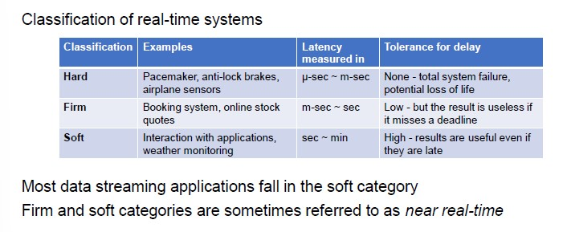

# Data Streaming

Big data is not just about *batch analysis*, but also about analyzing **data streams**.

Streaming data processing is a big deal in big data for many reasons:

- Latency (produce results in a more timely manner)
- Workload balancing (distribute the workload in an efficient way)

Despite this business-driven surge of interest in streaming, batch system are generally more mature than their streaming brethren.

**Use cases:**

- Operational monitoring
- Web analytics
- Online advertising
- Social media
- Intern of Things

## Real time Data Streaming

For some systems, real-time is crucial. For example, a system that displays stock options has no tolerance for delay.

In some systems, delays would imply the total system failure (like with pacemaker).

## Streaming System

The term streaming has been used for a variety of different things but in our context, a system for data streaming is a type of data processing engine that is designed with infinite datasets in mind.

Both batch engines and streaming engines can be used to process infinite datasets.

**Data Streaming Characteristics**:

- Infinite dataset (no control over the order in which elements arrive)
- Infinite computation (there must be a plan to avoid overflowing and enable auto-scalability)
- Low-latency , approximate and speculative results
    - Since we want to process data in real-time, data can usually be processes a single time
    - Only a fraction of the dataset can be kept in memory for analysis
    - Approximation may be required to accommodate the low-latency requirements

## Data Stream Models

- **Time series Model** (stock prices)
- **Cash Register Model** (packages sent to IP addresses)
- **Turnstile Model** (people entering a subway)
