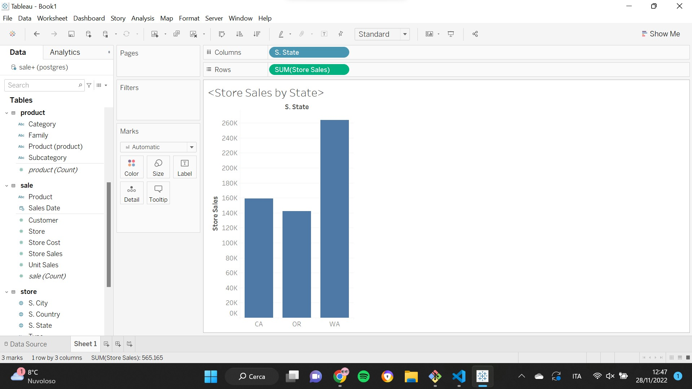
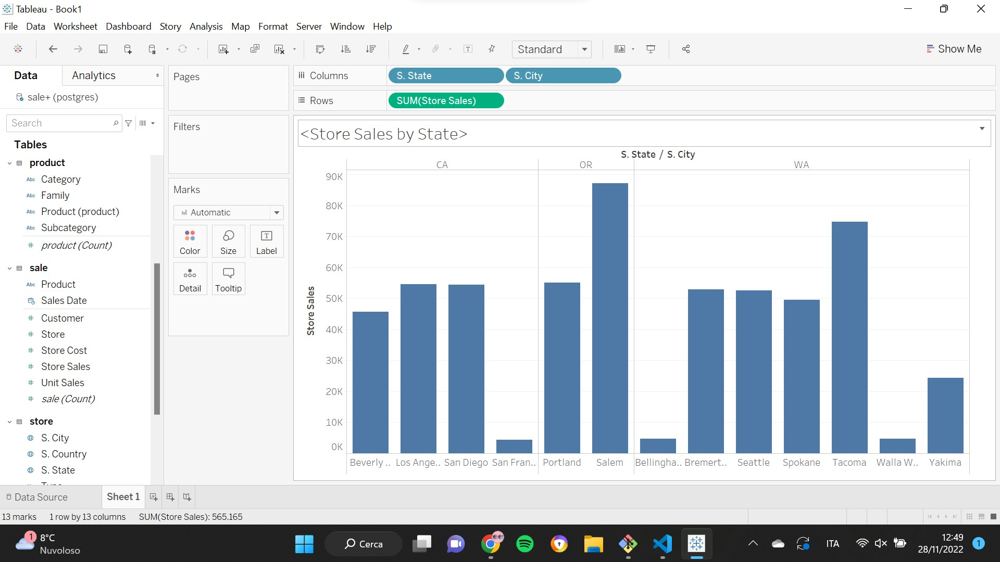
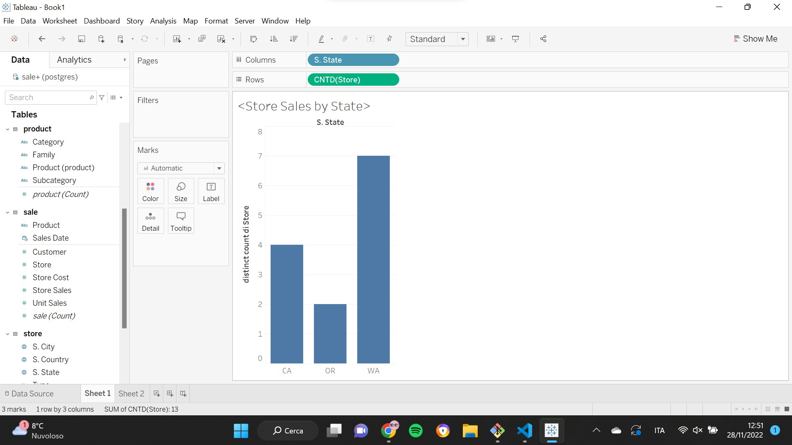
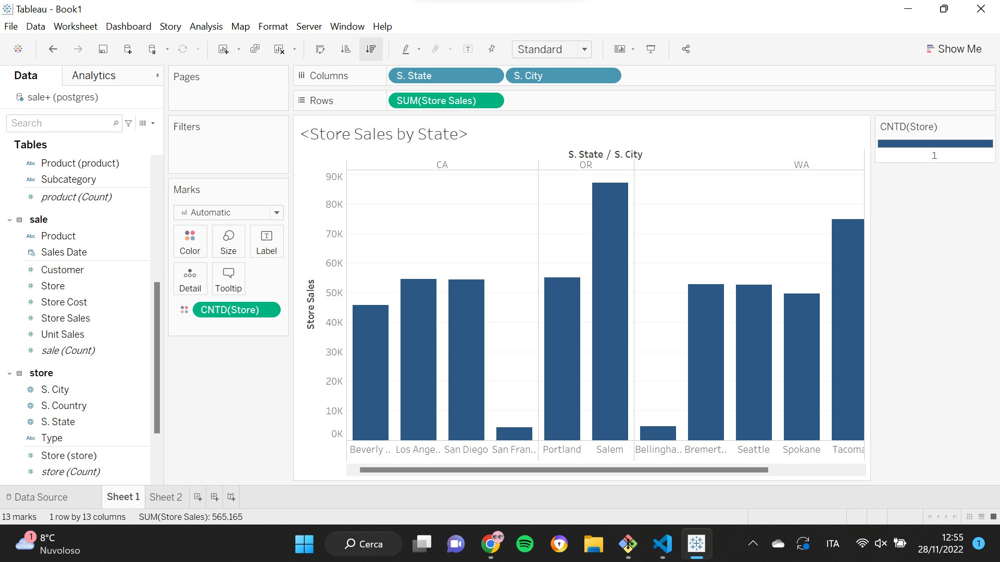
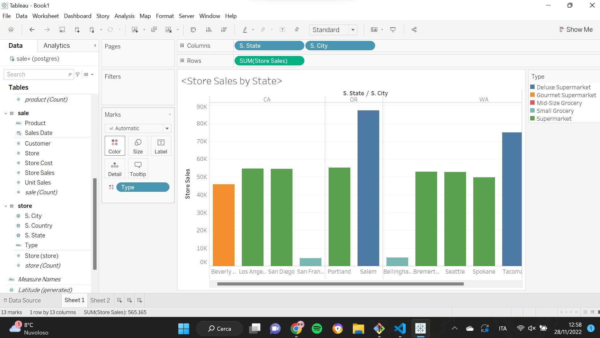
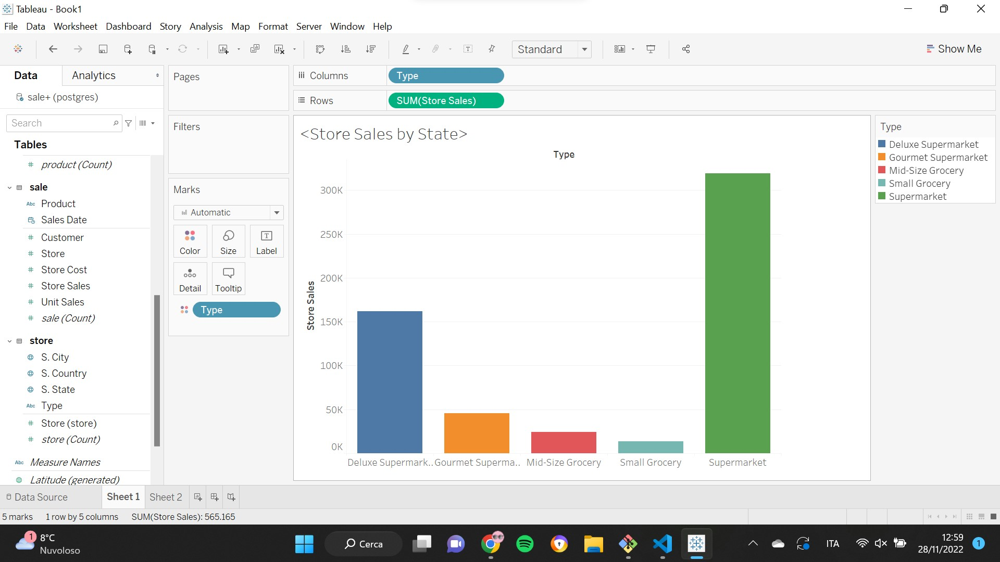

# AWS Lab

## Data Ingestion

We start by creating 2 buckets:

> landing_bucket = "s3://landing-raw-sales-911/"
> staging_bucket = "s3://staging-clean-sales-911/"

Then, we upload the three csv filed on the landing bucket and we merge the data into a single data frame:

```python
file_names = ["s3://staging-clean-sales-911/sales_fact_1997.slice-0-1.v0.0.1.csv", 
"s3://staging-clean-sales-911/sales_fact_1997.slice-1-2.v0.0.1.csv", 
"s3://staging-clean-sales-911/sales_fact_1997.slice-2-3.v0.0.1.csv",]
    
df = pd.concat(map(pd.read_csv, ["s3://landing-raw-sales-911/sales_fact_1997.slice-0-1.v0.0.1.csv", 
                                "s3://landing-raw-sales-911/sales_fact_1997.slice-1-2.v0.0.1.csv", 
                                "s3://landing-raw-sales-911/sales_fact_1997.slice-2-3.v0.0.1.csv"]), 
                                ignore_index = True)
print(df)
```

Now that we have manipulated data, we store them into the staging bucket:

```python
wr.s3.to_csv(df = df, path = staging_bucket + "merged-sales-fact", index = False)
```

## Data Understanding

We study the dataset trying to identify the domain:

> df.info()

The variables contained in the data frame are:

- Customer City -> State -> Country
- Customer
- Yearly Income
- Category -> Subcategory -> Family -> Product
- Store City -> State -> Country
- Store
- Type
- Sales Date
- Store Cost
- Store Sales
- Unit Sales
    
> DT_Customer = (C.City, C.Country, C.State, Customer, Yearly_Income)

> DT_Product = (Category, Subcategory, Family, Product)

> DT_Store = (S.City, S.Country, S.State, Store, Type)

> DT_Date = (Sales_Date)

> FT_Sale = (Customer:DT_Customer, Product:DT_Product, Sales_Date, *Store_Cost*, *Store_Sales*, *Unit_Sales*)

Then, we create a relational DW and we load the tables:

```python
host = "database-lab.cepvkrc8ii6y.us-east-1.rds.amazonaws.com"
port = 5432
user = "postgres"
pwd = "bigdata2022"
db = "postgres"

from sqlalchemy import create_engine
s = 'postgresql://{}:{}@{}:{}/{}'.format(user, pwd, host, str(port), db)
engine = create_engine(s)

dt_customer.to_sql('customer', engine, index=False, if_exists='replace')
dt_product.to_sql('product', engine, index=False, if_exists='replace')
dt_store.to_sql('store', engine, index=False, if_exists='replace')
dt_date.to_sql('date', engine, index=False, if_exists='replace')

ft_sales.to_sql('sale', engine, index=False, if_exists='replace')
```

## Tableau

We load the data on Tableau through Server (PostGRE) and we define query the data to obtain relevant information.












