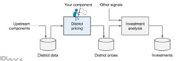

# California House Pricing

Integrated lab: start from raw data and understand them through machine learning techniques

## Building Data Pipelines

Following the CRISP methodology, the steps to undertake to build a data pipeline include:

1. Frame the problem and look at the big picture
2. Get the data
3. Explore the data to gain insights
4. Prepare the data
5. Explore different models and find the best ones
6. Fine-tune your models
7. Present your solution
8. Launch, monitor, and maintain your system

**Our Task:**

The goal is to predict a district's median housing price.

With continuous value, the type of analysis that we need to do is **regression**, while with qualitative data we need to do **classification**.

```
Supervised: data have labels that describe them
Unsupervised: no labels
```

In this case, we will have to build a **supervised** model with **regression**.



To measure the performance of our model, we should check the distance between our value and the real house price.

## Colab Notebook

1. Install dependencies (keep track of the libraries and their versions)
    - Dependency management
2. Read data
    - Pandas
    - Sklearn
3. Dataset exploration (understand the semantic)
4. Transform data (choose the right encoding system based on the data you have. We cannot use an ordinary encoding with nominal values like eye color)
    - One hot encoding
    - Ordinary encoding 
5. How to handle missing values:
    - Replace them with default values
    - Drop the row
    - Drop the column
6. Check data types and change them to minimize memory occupation (from float64 to float32)