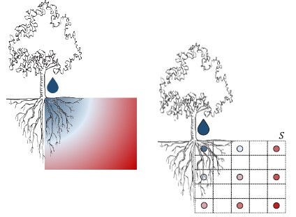
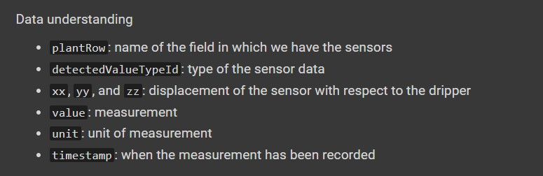

# From Data Lake to Data Warehouse

**Context:** Soil moisture monitoring

Optimizing soil moisture is crucial for watering and crop performance:
The **goal** is to build an expert system to save water while improving fruit quality, having the following information:

- Soils have different water retention
- Watering systems have different behaviors 
- Plants have different water demand
- Sensors produce different measurements with different precisions

## Scenarios of DT in Agriculture

**Scenario 1:** The technician controls the watering system based on the experience, without the use of digital data / KPIs and automation.

**Scenario 2:** The control of the watering system is refined by observing sensor data (digitalized but no KPIs).

**Scenario 3:** Sensor data feeds a decision support system, knowing how to optimize KPIs, controls the watering system.

## Plan of Action

We need to understand how soil behaves.
This can be done by simulating the soil behavior according to physical models.

However, a fine tuning is required and we need to know and parametrize everything.
Tuning can take months and is extremely time consuming.

We can use **sensors** to observe the behavior of soil by observing its behavior with and without water.



They collected data for 2 years, generating 16GB of data.

## AWS

We need to create a storage space:

> Services - Storage -S3

> Create Bucket

Buckets need to have a **unique name** (landing-raw-wateringsensors-789), we need to choose the location, and ACL (access control list).
Then, we can choose ti keep it public or set it private.

S3 automatically assign an id to each value, but if we add **version control**, it will also assign a *version id*, which will allow us to keep track or the versions.

**Structure:**

Ingestion pipeline -> landing -> algorithm -> staging -> algorithm

We do not need to know how the storage work, we just need to know where data are stored (**serverless service**).
It is pay-per-use, any time we move data from a bucket to another, we pay a certain amount of money.

## Load data

Load a CSV data in the bucket.

The first step is to understand the domain through **AWS sagemaker**.

> Notebook - notebook instance - create notebook instance - open Jupyter

1. Choose a name for the notebook
2. Choose the machine (ml.t3.medium)

**AWS wrangler** allows you to use AWS functionalities as if it was pandas (*maybe it is a python library*).

## Notebook

As soon as you open the jupyter notebook, it asks you to select the **kernel**.

> conda_python3



Get rid of missing and useless data.

**Relational DataWarehouse**

```

FactTable: (timestamp, hour, date, month, year, sensor, distance, depth, value)

DT-time: (timestamp, hour, date, month, year)

DT-sensor: (sensor, dist, depth)

RELATION: (timestamp, sensor, value)

```


