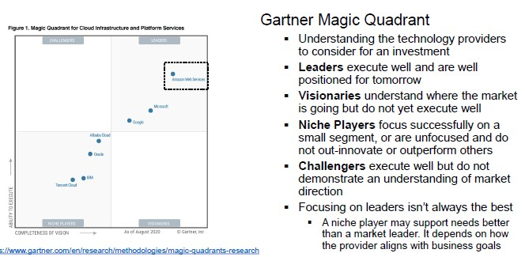
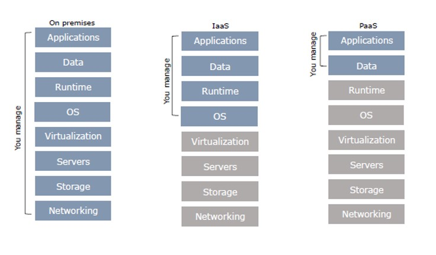

# Cloud Computing

Cloud solutions are not only related to increased volume of data, but also to changes in the inflow of data.

**Cloud computing** refers to a model for enabling ubiquitous, convenient, on-demand network access to a shared pool of configurable computing resources that can be rapidly provisioned and released with minimal management effort or service provider interaction.

Cloud characteristics:

- On-demand self-service (consume services when you want)
- Broad network access (consume services from anywhere)
- Resource pooling (infrastructure, virtual platforms and applications)
- Rapid elasticity (enable horizontal scalability)
- Measures service (pay for the service you consume as you consume)

Digital transformation involves the cloud to create/change business flows.

The main drivers of cloud computing are:

- **Scalability** (not possible on premises)
- **Elasticity**
    - Automatically scale resources in response to run-time conditions
    - Adapt to changes in workload by turning on/off resources to match the necessary capacity
    - Core justification for the cloud adoption
- **Resource pooling**
    - Cost-sharing (resources are dynamically reassigned according to demands)
    - Economy of scale
    - Based on virtualization, running multiple virtual instances on top of a physical computer system
- **Reliability** (handle failures and highly available)
- **Worldwide deployment** 
- Measured **quality of service** (services leverage a quantitative qualitative metering capability making pay-as-you-go)
- **Service integration**
    - Abstract and automatically adapt the architecture to requirements
    - Integration and abstraction are drivers of change

Cloud computing is the outsourcing of a company's hardware and software architecture.
The risks involved include:

- Vendor Lock-in
- Storage
- No control over data (security)

## Types of Service Providers

There are different types of cloud:

- **Public** (accessible to anyone like Microsoft, AWS, Google ...)
- **Private** (accessible by individuals within an institution)
    - Cost-sharing disappears in private clouds
    - Security
- **Hybrid** (a mix of the previous)

Cloud services are hosted in separate geographic areas.
Locations are composed of regions (independent geographical area that groups data centers) and availability zones (data center).

**Main vendors**

## Deployment Models

On a cloud architecture, you can rely on serverless or managed services.

**Serverless service**

- Standalone independent services built for a specific purpose and integrated by cloud service provider
- No visibility into the machines
- Pay for what your application uses, usually per request or per usage

**(Fully) Managed service**

- Visibility and control of machines
- Do not have to set up any machines, the management and backup are taken care for you
- Pay for machine runtime no matter how long you run the machines and resources that your application uses

Understanding architectures is paramount to successful systems.
Good architectures help to scale.

**XaaS** (anything as a service)

A collective term that refers to the delivery of anything as a service.
It encompasses the products, tools and technologies that vendors deliver to users.

Paas and containers are potential solutions to inconsistent infrastructures.
It provides a platform for users to run their software in which developers write software targeting features/capabilities of the platform.

**Containers** and **virtual machines** are packaged computing environments:

- Containers (self-contained environments)
- Virtual machines (emulate hardware/software systems on top of hypervisor)

**FaaS** (function as a service)

Coding environment, cloud provider provisions platform tu run the code.
Infrastructure provisioning and management are invisible to the developer.

Faas is based on a serverless approach, use a compute service to execute code on demand.
Every function could be considered as a standalone service.

Faas is not appropriate for latency-sensitive applications.

**SaaS** (software as a service)

Application environment where access cloud-based apps run over the internet.

**Data-driven companies**

1. Is the technological infrastructure appropriate to support data collection and analysis?
2. Are processes extensively digitalized and produce reliable data?
3. Do we have the right people to drive the project and exploit the result?