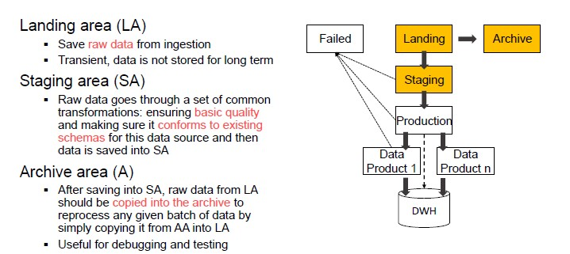
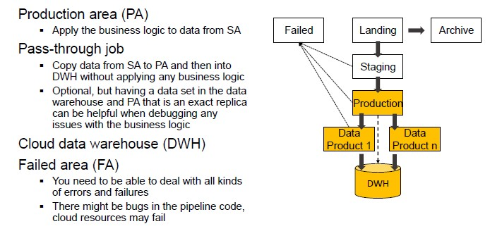
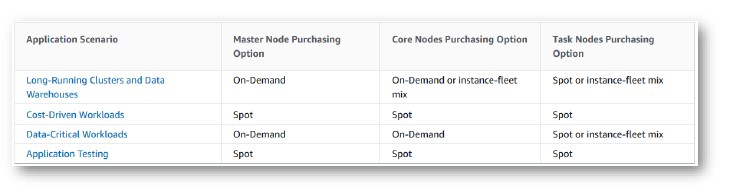

# Building Data Pipelines in the Cloud

**Data pipeline:** a sequence of operations to transform and consume raw data

The pyramid abstracts tons of techniques which if we want to provide them as services, architecting data pipelines on cloud requires:

- Standardization
- Integration
- Orchestration
- Accessibility through simple APIs

**Data pipeline in AWS:**

With stream data, data are *pushed* in the data platform, while with batch data, data are *pulled* from the repository.

**Data pipeline in Google cloud:**

The organization of the services is the same, both in AWS and in Google.

## Pipeline Organization

1. Ingestion  (collect raw data from transaction, logs and IoT devices)
2. Transformation (make data consumable by sorting, aggregating, and applying business logic to produce meaningful analytical datasets)
3. Consume data (querying and BI tools)

This is not a sharp taxonomy, for example data streams can also be processed during the ingestion phase and databases can serve both processing and serving capabilities.

## Storage

The goal of storage is to persist data.
To choose the most suitable storage platform, we need to consider:

- Storage model (how data are organized)
- Access frequency (how often do we access data)
- Analysis to be performed

**AWS S3** - serverless AWS storage service

AWS S3 saves data as objects within buckets. An object is composed of a file and any metadata that describes that file.

**Buckets** are logical containers for objects.

Benefits of AWS S3:

- Centralized data architecture
- Decoupling of storage from compute and data processing

**Access frequency (AWS)**

Object storage classes:

- Standard (general purpose)
- Infrequent (rapid access)
- One Zone-IA (lower cost option for infrequently accessed data)
- Glacier (low cost storage class for data archiving)
- Deep Glacier (long-term retention for data accessed once or twice a year)
- Intelligent-Tiering (move objects between access tiers when access patterns change)

**Lifecycle** configuration: a set of rules that define actions that Amazon S3 applies to a group of objects.

We can identify two types of actions:

1. Transition (object transition to another storage class)
2. Expiration (AWS deletes expired objects)

## Organizing Data Lake

Having consistent principles on how to organize your data is important to build standardized pipelines with the same design with regard to where read/write.
Also, standardization makes it easier to manage your pipelines at scale and helps users search for data in the storage.

Using folders to organize data inside areas into a logical structure can be useful:

> Namespace

Logically group multiple pipelines together.

> Pipeline name

Each data pipeline should have a name that reflects its purpose.

> Data source name

Ingestion layer will assign a name to each data source you bring into the platform

> BatchId

Unique identifier for any batch of data that is saved into LA.

Different areas will have slightly different folder structures:

> /landing/ETL/sales_oracle_ingest/customers/01DFTFX89YDFAXREPJTR94

## Supporting Data Pipelines

We can choose the XaaS configuration:

- IaaS (AWS EC2) - outsource virtual machines to the cloud
- PaaS (AWS EMR) - outsource the data ecosystem to the cloud

If we want to build a cluster on premise, we will need to buy the hardware and the networking devices.
On the other hand, by choosing a IaaS, you just need to define virtual machines while with PaaS, you just choose the cluster.

- On premise cost: the price of the hardware is depreciated in three years
- IaaS: on-demand price, you pay for the virtual machines even if you do not use them

AWS offers different pricing and service solutions for EC2:

- On-Demand pricing: you pay for the machine time by the hour or the second (good for short-term commitments).
- Spot instances: you can request spare EC2 computing capacity when others are not using them (if the 'owner' needs it, AWS will stop your execution).
    - Hourly price is called *spot price*

On the other hand, Amazon EMR allows you to have **Spark clusters**.
The user access to the cluster and choose the level of abstraction.

The price depends on the region in which you place the cluster.

## AWS EC2

Amazon Elastic Compute Cloud is a web service that provides resizable capacity, allowing complete control of computing resources:

- The **instance type** determined the hardware
- The **Amazon Machine image** is a software template (virtual machine image)

## AWS EMR

Amazon EMR is a data platform based on the Hadoop stack in which you can have different types of cluster templates and scalability is managed by AWS.

The cluster structure is composed by three nodes:

1. Master node (controls the cluster, always up and running)
2. Core node (core instances run data node daemons)
3. Task instances

Both master and core nodes must always be on, for this reason, this solution is expensive because machines are always up and running.

The central component of Amazon EMR is the **cluster**.
The node type identifies the role within the cluster:

- **Master** node coordinates the distribution of data and tasks among other nodes
- **Core** node runs and store data in the Hadoop Distributed File System
- **Task** node only runs tasks

**Spot instances cost strategies:**

- Capacity-optimized strategy (allocate instances into the most available pools)
- Lowest-price strategy (allocate instances in pools with lowest price at time of fulfillment)

Amazon EMR provides two main file systems.
HDFS and EMRFS specify which file system to use by the prefix.

> hdfs://path or s3://DOC EXAMPLE BUCKET1/path

**Command Line Interface**

Clusters can be created using the CLI, which is useful for scalability and automation.

