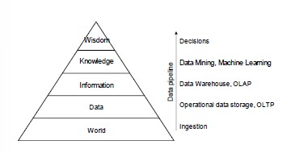
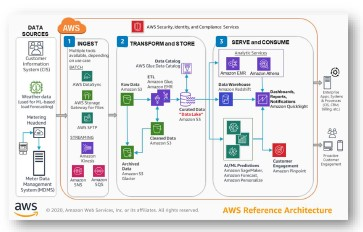
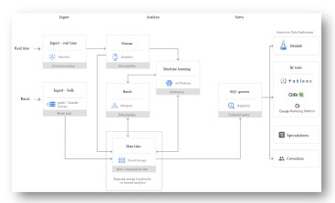
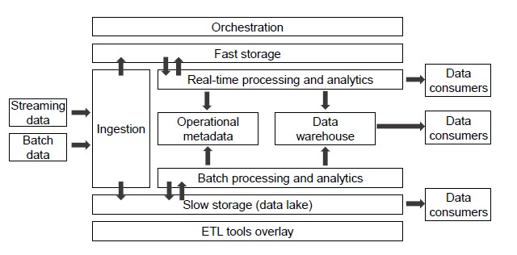

# Building Data Pipelines in the Cloud

**Data pipeline:** a sequence of operations to transform and consume raw data

The pyramid abstracts tons of techniques which if we want to provide them as services, architecting data pipelines on cloud requires:

- Standardization
- Integration
- Orchestration
- Accessibility through simple APIs

**Data pipeline in AWS:**

With stream data, data are *pushed* in the data platform, while with batch data, data are *pulled* from the repository.

**Data pipeline in Google cloud:**

The organization of the services is the same, both in AWS and in Google.

## Pipeline Organization

1. Ingestion  (collect raw data from transaction, logs and IoT devices)
2. Transformation (make data consumable by sorting, aggregating, and applying business logic to produce meaningful analytical datasets)
3. Consume data (querying and BI tools)

This is not a sharp taxonomy, for example data streams can also be processed during the ingestion phase and databases can serve both processing and serving capabilities.

## Storage

The goal of storage is to persist data.
To choose the most suitable storage platform, we need to consider:

- Storage model (how data are organized)
- Access frequency (how often do we access data)
- Analysis to be performed

