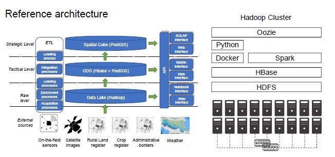
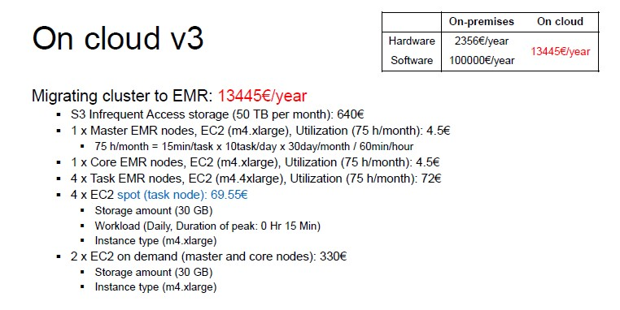

# Cluster Migration

The goal is to evaluate the costs for a cloud/on-premises data platform.

The average price for one machine (with the features needed) is €3000 and we need 18 machines.
The total price for hardware is €10,602 a year for three years.

Concerting the software cost, Cloudera Management System was free until March 2020 then, the cost for one node is €10,000, for a total amount of €180,000 a year.

They started considering migrating to the cloud with AWS, moving a Hadoop cluster to the cloud.

Steps:

- Coarse tuning (identify the dominating cost)
- Identify a suitable budget
- Implement and refine (wrong refinements can do a lot of damage)

## On cloud

It makes no sense to move the cluster as-is because it is too expensive.
There is no point in moving 18 machines if we are not using all of them.

The first thing to do is to understand the **workload**: depending to the stack, the overall target of storage is 50 TB per year (satellite images).

If we consider different tier plans, for example switching from standard to *infrequent access*, the overall cost is lower.

Moving from HDFS to S3, the price is lower but you are losing performance (data locality).

Given the software requirements, we need:

- 1 Master node
- 1 Core node
- 4 Task nodes

