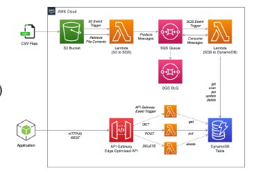

# Data Pipelines on Cloud - Streaming

Batch vs Streaming systems:

One of the main difference between batch and streaming is **latency**. With streaming systems, latency is expected to be very short, which with batch data it may takes hours to execute data.

With streaming systems results are usually approximate while batch systems provide exact results by processing massive data at once.

Batch systems are engine that are capable of handling processing on **bounded** datasets.
While streaming systems are engines capable of handling processing on **unbounded** dataset.
Streaming is a superset of batch processing.

## Ingestion

The goal of data ingestion is to move data to the cloud.
With batch ingestion, the goal is to move data from on-premises storage, following this workflow:

- Receive shipment
- Set up
- Transfer data
- Ship back

With streaming systems, data flows in both directions so storage systems are both sources and destinations for data transformations.

The streaming is continuous, with unlimited succession of individual events ordered by the point in time at which each event occurred.

The general idea is to collect events from many source systems, store them in a unified log and enable applications to operate on these event streams.

With **unified log**, a single log in a company with applications sending/reading events, while with **append-only log**, new events are appended to the unified log.

**Distributed Systems**

The unified log lives across a cluster of machines.
Distribution ensures:

- to do

**Ordered system**: events in a shard have a sequential IDs (allows append-only).

With streaming data, we can identify two types of processing:

- **Single-event**: a single event produces zero or more events
- **Multiple-event**: multiple events collectively produce zero or more events
    - Aggregating data
    - Functions like minimum, maximum or average
    - Pattern matching (with DoS)
    - Reordering events on a sort key

**Amazon Kinesis Data Streams**

It is created and provisioned by shard (each shard provides 1 MBps and 1000 data puts per second).

Consumers get records by shard (records are sorted by partition key and sequence number). Ordering is not guaranteed across shards.

Kinesis works like `kafka`.

Records are retained for 7 days at maximum.

Shards allow scalability (scale-out), they can be split into two or merged.
Users must scale shards up and down manually.

## Lambda Function

Apart from Paas, Saas and Iaas, we can also have functions as a service.

AWS Lambda allows you to build pipelines incrementally.

Lambda allows you to build a function and compose it on a pipeline. The idea is to build a function and then re-using it.

Functions are **modular** and they can be easily integrated across the system. 

The Lambda runtime invokes a lambda function multiple times in parallel. 

A function is composed as follow: `code + configuration + dependencies`.

**Serverless Computing rules:**

- If you want your code to be reusable, functions should do only one thing (single-purpose).
- A function that does just one thing is more testable and robust
- A function with a well-defined interface is also more likely to be reused
- Code should be created in a **stateless style** (the execution of the function should be independent from any state)
    - Statelessness allow scalability
    - Local resources or processes will not survive along sessions
- Functions that terminate sooner are cheaper

*How can we accurately calculate the cost*

We can create a test environment which simulates the behavior of the system.

## Pattern for data pipelines

Pattern are architectural solutions to problems in software design. It is a template for how to solve a problem in many different situations.

**Command pattern**

A behavioral design pattern in which an object is used to encapsulate the information needed to perform an action or trigger an event.

Patterns are usually categorized according to the scope. In this case we are considering behavioral patterns as we need to specify how services are interacting with each others.

The `lambda function` encapsulate a request as a object. The command function is used to invoke other functions and services. It knows which functions to invoke in response to data/events and how to call those functions.

**Pipes and filters patter**

Decompose a complex processing task into a sequence of manageable services.

- COmponents designed to transform data are referred to as filters.
- Connectors that pass data between components are referred to as pipes.

**Messaging patter**

Massaging patterns describe how two different parts of a message passing system connect and communicate with each other.

Decouple services from direct dependence and allow storage of events in queue:

- Reliability: if the consuming service goes offline, messages are retained in the queue and can still be processed.
- A message queue can have a single sender/receiver or multiple sender/receiver.

**Priority queue pattern**

**Decouple** and prioritize requests sent to services:

- Requests with a higher priority are received and processed more quickly than those with a lower priority.
- Useful in applications that offer different service level guarantees.

**Control** how and when messages are dealt with:

- Different queues, topics, or streams to feed messages to your functions.
- High-priority messages go through expensive services with more capacity.