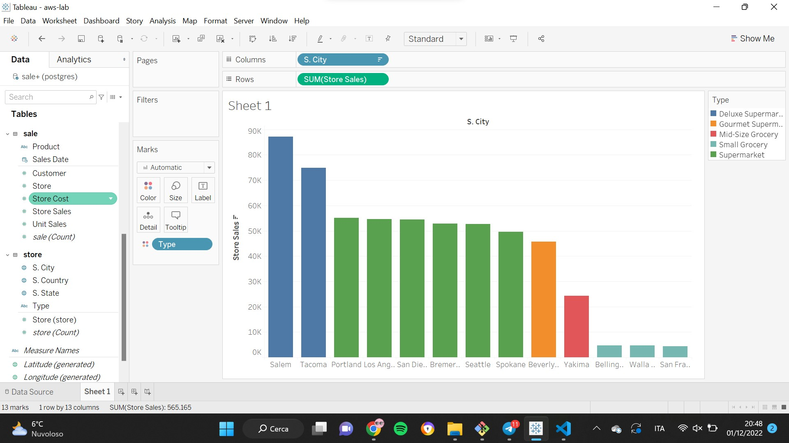
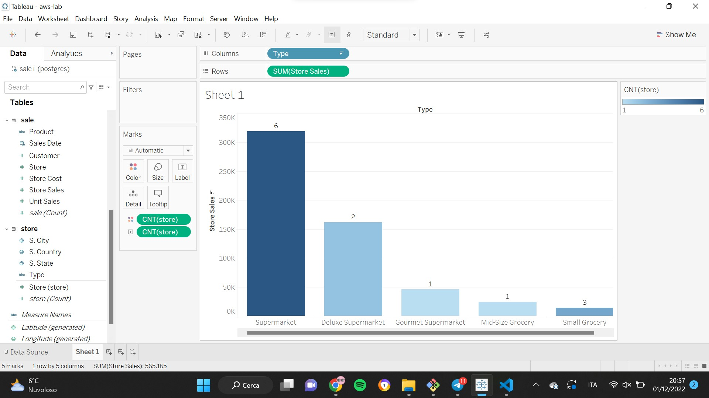
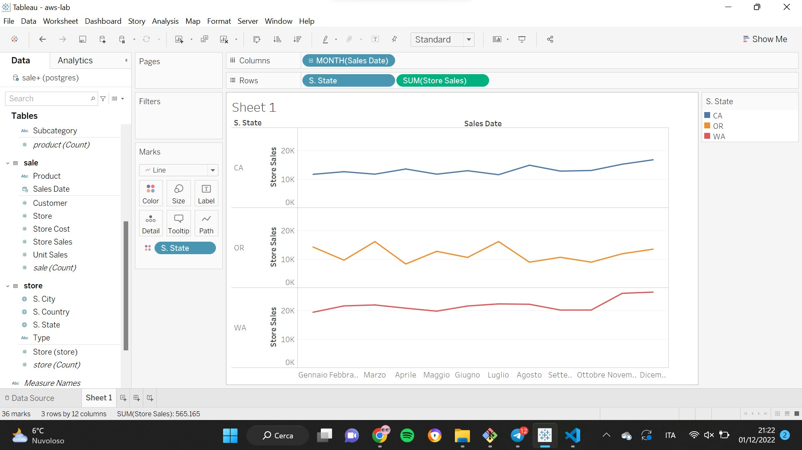
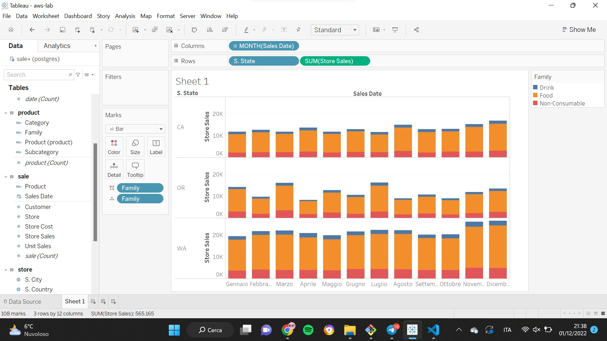

# AWS Lab

## Data Ingestion

We start by creating 2 buckets, one for raw data (*landing*) and one for cleaned data (*staging*):

**landing_bucket** = "s3://landing-raw-sales-911/"

**staging_bucket** = "s3://staging-clean-sales-911/"

Then, we upload the three csv files on the **landing bucket** and we merge the data into a single data frame:

```python
df = pd.concat(map(pd.read_csv, ["s3://landing-raw-sales-911/sales_fact_1997.slice-0-1.v0.0.1.csv", 
                                "s3://landing-raw-sales-911/sales_fact_1997.slice-1-2.v0.0.1.csv", 
                                "s3://landing-raw-sales-911/sales_fact_1997.slice-2-3.v0.0.1.csv"]), 
                                ignore_index = True)
print(df)
```

Now that we have prepared the data, we store them into the **staging bucket**:

```python
wr.s3.to_csv(df = df, path = staging_bucket + "merged-sales-fact", index = False)
```

## Data Understanding

We study the dataset trying to identify the **domain**:

> df.info()

The variables contained in the data frame are:

- Customer City -> State -> Country
- Customer
- Yearly Income
- Category -> Subcategory -> Family -> Product
- Store City -> State -> Country
- Store
- Type
- Sales Date
- Store Cost
- Store Sales
- Unit Sales

Based on the context and on the purpose of the analysis, we create the following tables:
    
**DT_Customer** = (C.City, C.Country, C.State, **Customer**, Yearly_Income)

**DT_Product** = (Category, Subcategory, Family, **Product**)

**DT_Store** = (S.City, S.Country, S.State, **Store**, Type)

**DT_Date** = (**Sales_Date**)

**FT_Sale** = (Customer:DT_Customer, Product:DT_Product, Sales_Date, *Store_Cost*, *Store_Sales*, *Unit_Sales*)

Then, we create a relational DW with RDS and we load the tables that we created:

```python
host = "database-lab.cepvkrc8ii6y.us-east-1.rds.amazonaws.com"
port = 5432
user = "postgres"
pwd = "bigdata2022"
db = "postgres"

from sqlalchemy import create_engine
s = 'postgresql://{}:{}@{}:{}/{}'.format(user, pwd, host, str(port), db)
engine = create_engine(s)

dt_customer.to_sql('customer', engine, index=False, if_exists='replace')
dt_product.to_sql('product', engine, index=False, if_exists='replace')
dt_store.to_sql('store', engine, index=False, if_exists='replace')
dt_date.to_sql('date', engine, index=False, if_exists='replace')

ft_sales.to_sql('sale', engine, index=False, if_exists='replace')
```

## Tableau

*Set the public access and the security options*

We load the data on Tableau through Server (PostGRE) and we are ready to query the Data Warehouse to get useful insights.

### Exercise 1

*Display the sum of store sales divided by state*


The state with the highest *store sales* is Washington, followed by California and Oregon.


As we can see, some cities are way above the average line, in particular the city of San Francisco, Bellingham, Walla Walla and Yakima.

*How many stores are there in each city and in each state?*


To perform this calculation, we use `COUNTD`in order to count only the number of unique items and avoid the risk of miscalculating. As we can see, there is one single store per each city and, of course, the number of stores per state is proportionate to the number of cities.

*Can low sales in some cities be imputed to the number of stores?*


Considering that the number of stores in each is city is the same (1), we have no elements to believe that the store sales depends on this quantity.

### Exercise 2

*Associate the Store Type field with the color property and identify the pattern*



Looking at the figure, we can clearly identify a pattern between the store sales and the type of store. The store type with highest volume of sales is the **Deluxe Supermarket**, followed by Supermarkets, Gourmet Supermarkets, Mid-size and Small Groceries.

*Display the store sales for each Store Type. What discrepancy is possible to notice with respect to the previous chart?*


Based on the previous chart, we would expect deluxe supermarkets to have the highest sales amount, but, on the contrary, **supermarkets** show the highest value.

*What caused the discrepancy between the previous two visualizations?*



If we consider the number of stores for each store type, we can see that supermarkets are six while deluxe supermarkets are just two. This aspect explains the discrepancy between the two previous charts.

### Exercise 3

*Display the monthly sales trend*


The graph presents some ups and downs over the given period. In particular, we can identify three peaks during which the sales amount exceeds the average value: the first one is in March, the second in July and the last one from November to December.

*Is the previous pattern present in each state?*



By dividing the previous chart by state, the three peaks initially identified are less evident in California and Washington but we can still distinguish the growing trend over the last two months. 

On the other hand, for the state of Oregon we can clearly distinguish the peaks of sales during March, July and November.

*Given the previous chart, visualize how much impact the various families have on total sales while maintaining the monthly trend visualization*



As we can see from the chart, the different families of products have different weights on the total sales. **Food** has the highest impact on total sales, while non consumables and drinks are much less relevant.
