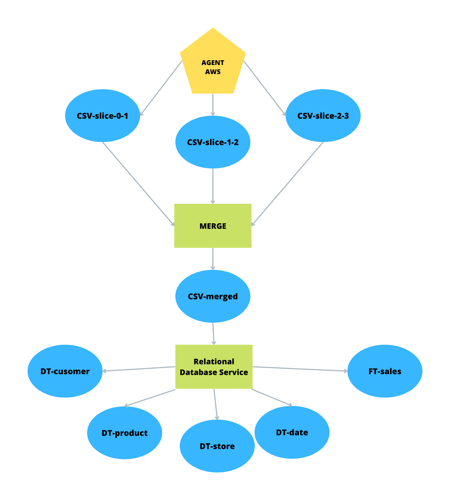

# Provenance Graph

The `PROV` standard defines a data model, serializations, and definitions to support the interchange of provenance information on the Web.
 Here **provenance** includes all the information about entities, activities, and people involved in producing a piece of data or thing, which can be used to form assessments about its quality, reliability or trustworthiness.

 

 An **entity** regards a physical or conceptual thing, which in our case should be the CSV files.

 **Activities** are dynamic aspects which allow the existence of entities.
 In our case, the activities that we performed to manipulate the data include:

 - Merge data into a single file
 - Create the Dimension tables
 - Create the Fact Table

 Finally, the **agent** is a piece of software that takes a role in an activity such that the agent can be assigned some degree of responsibility for the activity taking place.

 Maybe in our case the agent is AWS (?)

 ## Implementation

