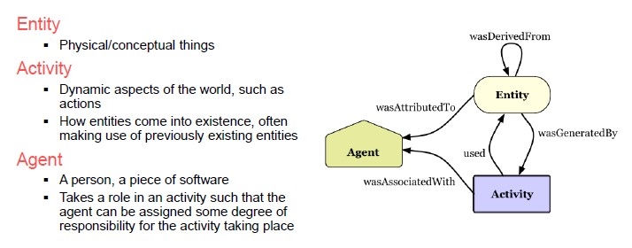
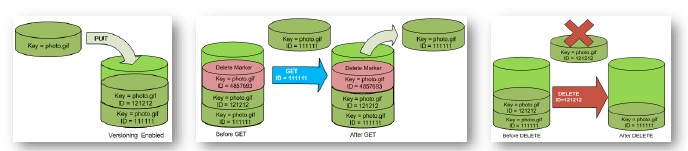

## Data Management

Requirements:

- Availability
- Consistency / Integrity
- Security
- Scalability
- Redundancy / Data Quality

## Data Provenance (lineage)

Data that describes the data by indicating the provenance.
As soon as data arrive in the database, we need to know its provenience.

*Use Cases*: Research

Collecting data is expensive so the scientific field is moving towards more collaborative research and organizational boundaries are disappearing.

Sharing data and metadata across organizations is essential but you need to identify the sources in order to avoid bad quality data.

For example, astronomers are creating an **international Virtual Observatory**.

Compression of data can be either lossless of lossy. Compressing data in astronomy can result in data corruption.

Decide the proper level of provenance is more art than science because storing too much data about provenance can be too burdensome.

**Granularity**

- Fine-grained (instance-level): tracking data items
- Course-grained (schema-level): tracking dataset transformation

**Queries**:

- Where (which input did the output come from)
- How (how were the inputs manipulated)
- Why (why was data generated)

## Data Profiling

In a data lake we have many different resources that need to be profiled.

In a relational scenario, tables of a relational database are scanned to derive metadata, such as data types and value patterns, completeness and uniqueness of columns, key ad foreign keys, and occasionally, functional dependencies and association rules.

At some point, collecting and managing data features can become too complex.

Use cases:

- Query optimization
- Data cleansing
- Data integration and analytics

However, the results of data profiling are computationally complex to discover.
Verification of complex constraints on column combinations in a database.

## Data Versioning

Version control refers to a class of systems responsible for managing changes to computer programs, documents, or data collection.

Changes are identified by a number / letter code, termed the revision / version number.

However, data pipeline is not only about code but also about:

- Model Version control
- Data version control
- Model parameter tracking
- Model performance comparison

Data versioning support **CRUD** (Create, REad, Update, Delete) operations with versions.

Storing different versions of a program can result in storage issues. 

## Compression and Entity Resolution

**Compression** allows a concise representation of a dataset in a comprehensible and informative manner.

**Entity resolution** finds records that refer to the same entity across different data sources.

*Is using metadata enough?*

No, metadata can become bigger than data themselves and data management is still a research issue in data platforms.
