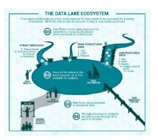
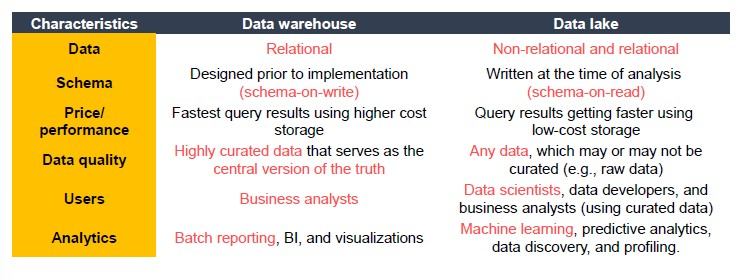

# From Database to Platform

How did we get here?

- **Data-driven innovation**
    - Data and analytics to foster new products, processes and markets
    - Drive discovery and execution of innovation, achieving new services with a business value
- **Analytics**
    - Umbrella term that include different BI and application-related initiatives
- **Advanced analytics**
    - Autonomous examination of data to discover deeper insights, make predictions, or generate recommendations
- **Augmented analytics**
    - Use of technologies such as ML and AI to assist with data preparation, insight generation and insight explanation 

## Data Platform

Getting **value** from data is not (only) a matter of storage.

**Database**

A database is a **structured** and persistent collection of information about some aspect of the real world organized and stored in a way that facilitates efficient retrieval and modification.
The structure of a database is determined by an abstract data model.

Operational databases are application-oriented.

**Data Warehouse**

A collection of data that supports decision-making processes.
It provides the following features:

- Subject-oriented
- Integrated and consistent
- Not volatile

Depending on the application or the workload, we need to identify the most suitable data model to adopt.

Data warehouse allows Operational Data Storage, which integrate data from different applications.

**Data Lake**

In the data lake, we can save data of different format (raw data). By storing raw data, we do not need to design ETL techniques, as with DW, but we can simply store data as they are.

Data lakes are centralized repositories used for storage, processing, and analysis of raw data, in which data is kept in its original format and is processed to be queried only when needed.

They can store a varied amount of formats in big data ecosystems, from unstructured, semi-structured, to structured data sources.

Data warehouse is mainly relational, while data lakes are not.

Data lakes have increasingly taken the role of data hubs.
Drawing a sharp line between storage, computation and analysis is hard. Architectural borderlines are blurred and DL are often replaced by **data platforms** or **ecosystem**.

**Data Platform**

AN integrated set of technologies that collectively meets an organization's end-to-end data needs such as acquisition, storage, preparation, delivery, and governance, as well as a security layer for users and applications.

We need to relieve users from complexity as they are only interested in the result.

Also, data transformation must be governed to prevent data platforms turning into a swamp.

